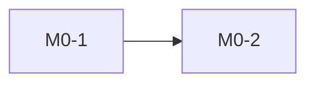

# Delivery Plan — <Project>

- Baseline: Technical Solution V<n> (`docs/solution.md`)
- Adapter: `.agents/delivery-workflow.json`
- Planned by: delivery-plan-bootstrap
- Last updated: <YYYY-MM-DD>

Execution rules live in `gated-delivery-workflow`. This file is the map; the
milestone files are the source of truth for Work Package status.

## Phases and Milestones

| Phase | Milestone | Goal | Packages | Checkpoint | File |
|---|---|---|---|---|---|
| phase0 | M0 | <goal> | <n> | none | `docs/tasks/M0.md` |

## Dependency Graph

## External Prerequisites

| ID | Needed by | Owner | Status |
|---|---|---|---|
| EXT: <item> | <WP IDs> | <who provides> | missing / available |

## Traceability

| Solution section | Requirement IDs | Work Packages | Notes |
|---|---|---|---|
| §<x> <title> | AC-1, INV-2 | M0-1 | |
| §<y> Future optimizations | — | — | Excluded: Future optimization |

## Authorization Log

Only explicit user authorization naming milestone IDs is recorded here.

| Date | Milestones | Phase | User's words |
|---|---|---|---|

## Replan History

| Date | From → To baseline | Summary | Dropped / Superseded |
|---|---|---|---|
